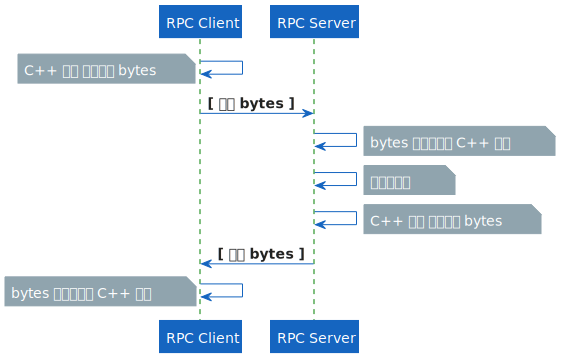

# Demo of Using Protocol Buffers and gRPC by C++

## 1. Rre-requisites

### 1.1. Protocol Buffers

- Protocol Buffers 源码编译安装指南：[Installation Guide of Protocol Buffers](./doc/0-install-guide.md#1-protocol-buffers)

- Protocol Buffers 编程使用指南：[Usage Guide of Protocol Buffers](./doc/1-usage-guide.md#1-protocol-buffers)

### 1.2. gRPC

- gRPC 源码编译安装指南：[Installation Guide of gRPC](./doc/0-install-guide.md#2-dependents-of-grpc)

- gRPC 编程使用指南：[Usage Guide of gRPC](./doc/1-usage-guide.md#2-grpc)

## 2. Demo Project

### 2.1. Compiling Source

执行下述命令编译此项目：

```shell
mkdir -p build && rm -rf build/* &&                                     \
        pushd build && /usr/bin/cmake .. &&                             \
        /usr/bin/cmake --build . --target clean -- -j 16 &&             \
        /usr/bin/cmake --build . --target proto_2_cxx -- -j 16 &&       \
        /usr/bin/cmake --build . --target grpc_2_cxx -- -j 16 &&        \
        /usr/bin/cmake --build . --target rpc_server_demo -- -j 16 &&   \
        /usr/bin/cmake --build . --target rpc_client_demo -- -j 16 &&   \
        popd
```

### 2.2. Run Demo

执行`build/src/server/rpc_server_demo <IPV4:PORT>`启动 RPC 服务端：

```shell
+-------------------------------+
| RPC-SERVER-DEMO               |
| date:   2021.05.24            |
| author: duruyao@hikvision.com |
+-------------------------------+

RPC Server listen on IPV4:PORT
```

执行`build/src/client/rpc_client_demo <IPV4:PORT>`启动 RPC 客户端：

```shell
+-------------------------------+
| RPC-CLIENT-DEMO               |
| date:   2021.05.24            |
| author: duruyao@hikvision.com |
+-------------------------------+

RPC Client connect to IPV4:PORT

---> [Point]
latitude: 302131223
longitude: 1202193223

<--- [Feature]
name: "point_2"
location {
  latitude: 302131223
  longitude: 1202193223
}
```

### 2.3. Working Sequence

此项目的工作时序如下：

<!-- ```plantuml
@startuml proto-grpc-req-rep

!include plantuml-style-c4/core.puml

"RPC Client" -> "RPC Client": 
note left: C++ 对象 序列化为 bytes

"RPC Client" -> "RPC Server": **[ 请求 bytes ]**

"RPC Server" -> "RPC Server":
note right: bytes 反序列化为 C++ 对象

"RPC Server" -> "RPC Server":
note right: 进一步处理

"RPC Server" -> "RPC Server":
note right: C++ 对象 序列化为 bytes

"RPC Client" <- "RPC Server": **[ 应答 bytes ]**

"RPC Client" -> "RPC Client": 
note left: bytes 反序列化为 C++ 对象

@enduml
```plantuml -->



- 客户端发送给服务端 **序列化** 的请求数据，接收服务端返回的 **序列化** 的应答数据，并 **反序列化** 为一个 C++ 中的对象，进一步处理。

- 服务端接收客户端发送的 **序列化** 的请求数据，**反序列化** 为一个 C++ 中的对象，进一步处理后，返回一个 **序列化** 的应答数据。

- 其中数据序列化均方式为 [Protocol Buffers](https://developers.google.com/protocol-buffers)，通信框架为 [gRPC](https://grpc.io/)。

### 2.4. Code Structure

此项目的代码结构如下：

```shell
.
├── CMakeLists.txt
├── src
│   ├── CMakeLists.txt
│   ├── client
│   │   ├── CMakeLists.txt
│   │   ├── demo.cpp
│   │   ├── rpc_client.cpp 
│   │   └── rpc_client.h
│   ├── proto
│   │   ├── gen
│   │   │   ├── route_guide.grpc.pb.cc
│   │   │   ├── route_guide.grpc.pb.h
│   │   │   ├── route_guide.pb.cc
│   │   │   └── route_guide.pb.h
│   │   └── route_guide.proto
│   └── server
│       ├── CMakeLists.txt
│       ├── demo.cpp
│       ├── rpc_server.cpp
│       ├── rpc_server.h
│       ├── rpc_service.cpp
│       └── rpc_service.h
└── tools
    └── cmake
        ├── use_absl.cmake
        ├── use_grpc.cmake
        ├── use_hiksdk.cmake
        └── use_proto.cmake
```

- [src/client](src/client)：RPC 客户端源代码目录

- [src/server](src/server)：RPC 服务端源代码目录

- [src/proto](src/proto)：`.proto`源文件目录

- [src/proto/gen](src/proto/gen)：`.proto`生成的 C++ 源代码目录

- [tools/cmake](tools/cmake)：自定义 CMake 工具目录
    
    - [tools/cmake/use_proto.cmake](tools/cmake/use_proto.cmake)：编译`.proto`文件生成 C++ 源文件（`.pb.cc`、`.pb.h`）
    
    - [tools/cmake/use_grpc.cmake](tools/cmake/use_grpc.cmake)：编译`.proto`文件生成 C++ 源文件（`.grpc.pb.cc`、`grpc.pb.h`）
    
在 [CMakeLists.txt](src/CMakeLists.txt) 中引入`use_proto.cmake`，设置`.proto`源文件目录`proto_src_dir`和生成 C++ 文件目录`proto_gen_dir`，之后项目增添了一个名为`proto_2_cxx`的 **target**。

CMakeLists 示例如下：

```cmake
set(proto_src_dir ${PROJECT_SOURCE_DIR}/src/proto)          ## set your folder of .proto files as `proto_src_dir`
set(proto_gen_dir ${PROJECT_SOURCE_DIR}/src/proto/gen)      ## generate .cc, .h files to `proto_gen_dir`
include(${PROJECT_SOURCE_DIR}/tools/cmake/use_proto.cmake)
```

编译`.proto`文件示例如下

```shell
/usr/bin/camke --build . --target proto_2_cxx -- -j 16
```